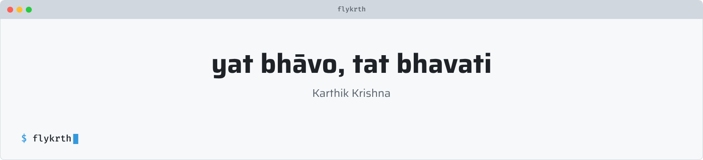

<picture>
  <source media="(prefers-color-scheme: dark)" srcset="art/header-dark.png">
  
</picture>

 

> No matter how ridiculous the odds may seem, within us resides the power to overcome these challenges and achieve something beautiful. And one day, we'll look back where we started and be amazed by how far we've come.

## Tech Stack

### Languages

### Frontend & Mobile

### Backend & Runtime

### Data & ML

### DevOps & Tooling

## Quote of the Day

  

